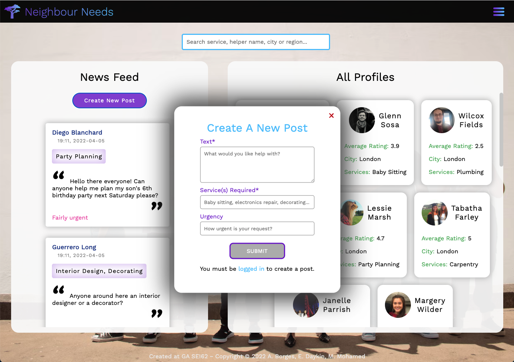
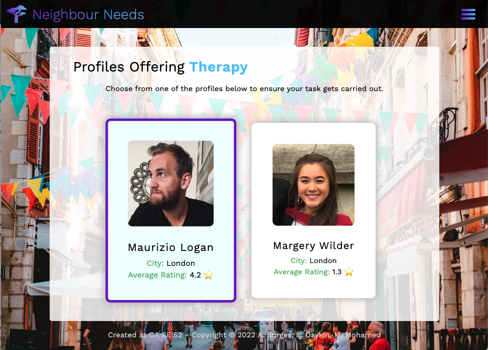
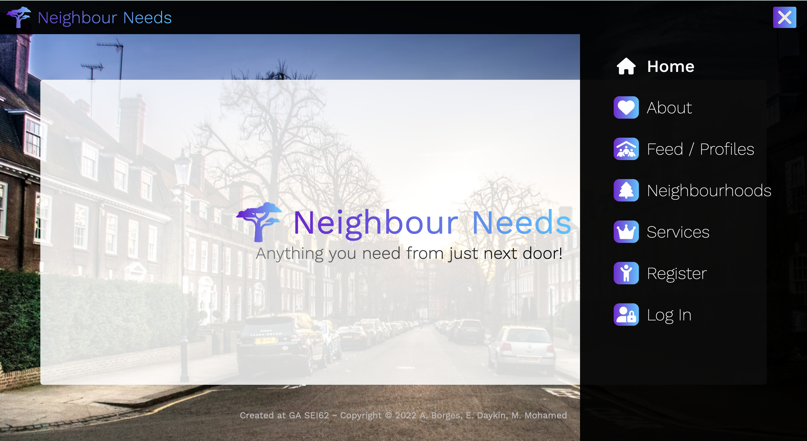

# GA Project Three - Neighbour Needs

<div align="center">

</div >

## Technologies Used

- Frontend

  - React.js
  - React-Router-Dom
  - Axios
  - CSS/Sass
  - NPM

- Backend

  - Node.js
  - Express
  - MongoDB
  - Mongoose
  - JWT
  - Bcrypt

- DevOps

  - Git, GitHub (Source control)
  - Netlify (Frontend deployment)
  - Heroku (Backend deployment)
  - Postman

- Other
  - Trello
  - Excalidraw

## To Run Locally

- The project has 2 repositories.
  - [Get the front end](https://github.com/Mafalda-hub/ga-project3-client)
  - [Get the back end](https://github.com/Mafalda-hub/ga-project3-api)

<em>Make sure you have Node.js installed locally</em>

You can find instructions for installing Node [here](https://nodejs.org/en/download/package-manager/)

- Starting the backend application

  - [Make sure you have MongoDB installed locally](https://www.mongodb.com/docs/manual/administration/install-community/)
  - From the root of the project, install the node_modules by running `npm install` in the terminal
  - Seed the database by running `npm run seed` in the terminal
  - Start the api by running `npm run start:server` in the terminal

- Starting the frontend application
  - From the root of the project, install the node_modules by running `npm install` in the terminal
  - Start the application by running `npm run start:client` in the terminal

## To Contribute

To contribute to this project, fork the repositories and make pull requests back to the upstream.

## The Approach Taken

As this was a group project we first pooled our ideas and decided to create an application that would facilitate community skill sharing. Users can create accounts and either advertise their skills to the local community, or as a skills-provider, advertise the services available.

We decided to split the tasks between the 3 developers in the team and create a kanban board using trello. This also provided experience in `agile workflows`. As part of this, we held daily standups to discuss what we had worked on in the previous day, the tasks that we would be tackling and any potential blockers we were aware of.

## My Responsibilities

- Backend

  - I was tasked with creating the schemas for profiles, posts and comments

```js
import mongoose from 'mongoose';
import bcrypt from 'bcrypt';
import mongooseHidden from 'mongoose-hidden';

import { emailRegex, passwordRegex } from '../lib/stringTesters.js';

export const commentSchema = new mongoose.Schema(
  {
    text: { type: String, required: true, maxLength: 300 },
    rating: { type: Number, required: true, min: 1, max: 5 },
    createdById: {
      type: mongoose.Schema.ObjectId,
      ref: 'Profile',
      required: true
    },
    createdByName: {
      type: String
    },
    createdBySurname: {
      type: String
    }
  },
  { timestamps: true }
);

const profileSchema = new mongoose.Schema({
  firstName: { type: String, required: [true, 'First name required'] },
  surname: { type: String, required: [true, 'Surname required'] },
  email: {
    type: String,
    required: [true, 'Email required'],
    unique: true,
    validate: (email) => emailRegex.test(email)
  },
  password: {
    type: String,
    required: [true, 'Password required'],
    minlength: [8, 'Password must be a minimum of 8 characters'],
    validate: (password) => passwordRegex.test(password)
  },
  isHelper: { type: Boolean },
  averageRating: { type: String },
  services: { type: Array },
  bio: { type: String },
  city: { type: String, required: [true, 'City required'] },
  region: { type: String, required: [true, 'Region required'] },
  imageProfile: { type: String },
  imageService: { type: String },
  comments: [commentSchema],
  posts: { type: Array },
  isAdmin: { type: Boolean }
});

profileSchema.pre('save', function encryptPassword(next) {
  if (this.isModified('password')) {
    this.password = bcrypt.hashSync(this.password, bcrypt.genSaltSync());
  }
  next();
});

profileSchema.methods.validatePassword = function validatePassword(password) {
  return bcrypt.compareSync(password, this.password);
};

profileSchema.plugin(
  mongooseHidden({ defaultHidden: { password: true, email: true } })
);

export default mongoose.model('Profile', profileSchema);
```

- - During the development, we realised that we wanted to remove the users password and email from the reponse data when a user logs in. After a little research, we found the `mongoose-hidden` package, which allowed us to specify that these keys should be hidden keys in the model.

  - Another of my tasks was to set up the backend controllers for posts

```js
import Post from '../models/post.js';
// import Profile from '../models/profile.js';

const createPost = async (req, res, next) => {
  try {
    if (!req.currentUser) {
      res.status(400).json({
        message: 'Unauthorised. You must be signed in to create a post.'
      });
    } else {
      // console.log('req.currentUser', req.currentUser);
      const newPost = await Post.create({
        ...req.body,
        createdById: req.currentUser._id,
        createdByName: req.currentUser.firstName,
        createdBySurname: req.currentUser.surname
      });
      // await Profile.updateMany(
      //   { _id: newPost.service },
      //   { $push: { posts: newPost._id } }
      // );
      const savedPost = await newPost.save();
      return res
        .status(201)
        .json({ message: 'Post successfully created', savedPost });
    }
  } catch (err) {
    next(err);
  }
};

const getAllPosts = async (req, res, next) => {
  try {
    const posts = await Post.find().sort({ createdAt: 'desc' });
    return res.status(200).json(posts);
  } catch (err) {
    next(err);
  }
};

const getAllPostsForProfile = async (req, res, next) => {
  try {
    const post = await Post.findById(req.params.id).populated('profiles');
    return res.status(200).json(post);
  } catch (err) {
    next(err);
  }
};

// helper function used in both deletePost and updatePost
async function checkProfileAndPerformAction(req, res, action) {
  const post = await Post.findById(req.params.id);
  // console.log('post', post);
  if (!post) {
    return res.status(404).json({ message: 'Post not found' });
  } else if (!post.createdById.equals(req.currentUser._id)) {
    return res.status(404).json({
      message: `Unauthorised action. You must be the creator of this post to ${action} it.`
    });
  } else {
    if (action === 'delete') {
      await post.remove();
      return res.status(204).json({ message: 'Successfully deleted post' });
    } else if (action === 'update') {
      post.set(req.body);
      const savedPost = await post.save();
      return res
        .status(200)
        .json({ message: 'Successfully updated post', body: savedPost });
    } else {
      return 'action needs to be `update` or `delete`.';
    }
  }
}

const updatePost = async (req, res, next) => {
  // console.log('req.currentUser.id', req.currentUser._id);
  try {
    checkProfileAndPerformAction(req, res, 'update');
  } catch (err) {
    next(err);
  }
};

const deletePost = async (req, res, next) => {
  try {
    checkProfileAndPerformAction(req, res, 'delete');
  } catch (err) {
    next(err);
  }
};

export default {
  createPost,
  getAllPosts,
  getAllPostsForProfile,
  updatePost,
  deletePost
};
```

- - The posts functionality is core to the application, so we needed handler functions in the controller for all [CRUD](https://developer.mozilla.org/en-US/docs/Glossary/CRUD) opperations.

  - My final task on the backend was to create the routing for the application.

```js
import express from 'express';
import profileController from '../controllers/profileController.js';
import postsController from '../controllers/postsController.js';
import commentsController from '../controllers/commentsController.js';
import userController from '../controllers/userController.js';
import secureRoute from '../middleware/secureRoute.js';

const router = express.Router();

// * FOR ALL USERS
// ADMIN only!
router.route('/users').get(secureRoute, userController.getAllUsers);

// Get all helpers
router.route('/profiles').get(profileController.getAllProfiles);

// * Search by firstName, surname, services, city and region
router.route('/profiles/:searchTerm').get(profileController.searchProfile);

// Get helper by id
router
  .route('/single-profile/:id')
  .get(profileController.getProfileById)
  .put(secureRoute, profileController.updateProfile) // same-user only
  .delete(secureRoute, profileController.deleteProfile); // admin only;

//* FOR POSTS
router
  .route('/posts')
  .get(postsController.getAllPosts)
  .post(secureRoute, postsController.createPost); // logged-in users only

// //*POSTS ID
router
  .route('/posts/:id')
  .put(secureRoute, postsController.updatePost) // same-user only
  .delete(secureRoute, postsController.deletePost); // same-user only

// *FOR EACH PROFILE AND CARD

router
  .route('/profile/:id/comments')
  .post(secureRoute, commentsController.createComment); // logged-in users only

router
  .route('/profile/:id/comments/:commentId')
  .put(secureRoute, commentsController.updateComment) // same-user only
  .delete(secureRoute, commentsController.deleteComment); // same-user only

router.route('/register').post(userController.registerUser);

router.route('/login').post(userController.loginUser);

export default router;
```

- - By utilising the [router functionality from Express.js](https://expressjs.com/en/guide/routing.html) we were able to group together our handler functions for CRUD operations onto endpoints. This helped to keep the code DRY and readable.

  - Contributing to the seeding data; as we wanted to be able to make changes to our data structures, we created seed data that could populate the database. This removed the need to create data inputs manually via postman and saved time during the devleopment process.

- Frontend

  - Development of React.js components to fetch data and render UI
  - Responsive design
  <div align="center">
  
  
  </div >
  - About page
  <div align="center">
  
  </div >
  - New post functionality in profile.js
  <div align="center">
  
  </div>
  - Other contributions to styling of various pages
  <div align="center" >
  <div margin="20px"></div>
  <div margin="20px"></div>
  <div margin="20px"></div>
  <div margin="20px"></div>
  <div margin="20px"></div>
  </div >

## Bugs, Blockers & Wins

- when someone registers as a new helper it doesn't get saved to the database as a helper. I plan to resolve this bug in a future release.

## Future Features & Key Learnings

- implement an edit profile function (where a user can edit their own profile, become a helper, add a bio etc),
- Messaging functionality where users can reach out to helpers to arrange appointments and request more information. This could possibly extend to a live chat feature.
